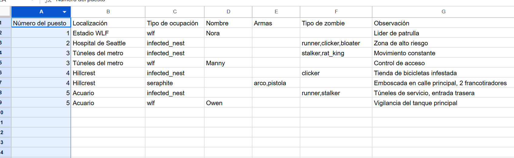

# README.md

## Instrucciones de Instalación y Ejecución (Entorno Docker)

Para ejecutar el proyecto, asegúrate de tener **Docker Desktop** instalado. El proyecto está completamente dockerizado y se inicia con un **único comando**. No necesitas dependencias locales (PHP, Composer, MySQL), ya que Docker lo gestiona todo.

1. Clona el repositorio y entra en el directorio del proyecto.
2. Copia `.env.example` a `.env` (opcional, ya que las variables están definidas en `docker-compose.yml`).
3. Ejecuta el siguiente comando para levantar el entorno:

```bash
docker-compose up -d --build

Esto inicia tres servicios:

php: Contenedor principal con Symfony.
mysql: Base de datos.
nginx: Servidor web.

4.Aplica las migraciones de base de datos (crea tablas y la vista consolidada):

docker-compose exec php php bin/console doctrine:migrations:migrate --no-interaction

5.Limpia la caché (opcional, para desarrollo):
docker-compose exec php php bin/console cache:clear

6.Accede a la aplicación en: http://localhost:8000

Para detener el entorno:
docker-compose down -v

Para limpiar completamente Docker (opcional):
docker system prune -a --volumes --forcé

Estructura de Entidades y Relaciones
El proyecto utiliza dos entidades principales con una relación uno a muchos:

Post (Puesto):

Campos: id (clave primaria), number (cadena única, ej. "1" a "8"), location (cadena, ej. "Estadio WLF").
Relaciones: OneToMany con Occupation (un puesto puede tener múltiples ocupaciones).
Repositorio: PostRepository para consultas.


Occupation (Ocupación):

Campos: id (clave primaria), type (cadena, ej. "wlf", "seraphite", "infected_nest"), wlfName (cadena, nullable), seraphiteWeapons (simple_array, nullable), infectedTypes (simple_array, nullable), observation (texto, nullable).
Relaciones: ManyToOne con Post (una ocupación pertenece a un solo puesto).
Repositorio: OccupationRepository para consultas.


La relación permite múltiples ocupaciones por puesto, con cascade persist/remove y orphan removal para mantener la integridad de los datos.

Ejemplo de Exportación Generada (CSV)
A continuación se muestra un ejemplo del archivo CSV exportado desde la aplicación (tras crear datos de prueba mediante el formulario). El CSV tiene cabeceras legibles y consolida la información de puestos y ocupaciones mediante la vista SQL v_occupation_consolidated.

Contenido del CSV de Ejemplo
Número del puesto,Localización,Tipo de ocupación,Nombre,Armas,Tipo de zombie,Observación
1,Estadio WLF,wlf,Abby,,,"Líder de patrulla"
1,Estadio WLF,seraphite,,machete,arco,"Grupo de vigilancia"
2,Hospital de Seattle,infected_nest,runner,clicker,"Nido activo"
3,Túneles del metro,wlf,Manny,,,"Control de acceso"
4,Hillcrest,seraphite,,arco,pistola,"Emboscada"
5,Acuario,infected_nest,,,stalker,bloater,"Zona infestada"


Captura del CSV de Ejemplo


El archivo de ejemplo está incluido en: docs/threat_map_example.csv
Se generó creando 5 puestos con diversas ocupaciones desde el formulario y exportando desde /posts/export.

Notas Adicionales

Gitflow: El repositorio utiliza ramas main (producción), develop (integración) y feature/* para funcionalidades (ej. feature/formularios, feature/export-csv).
